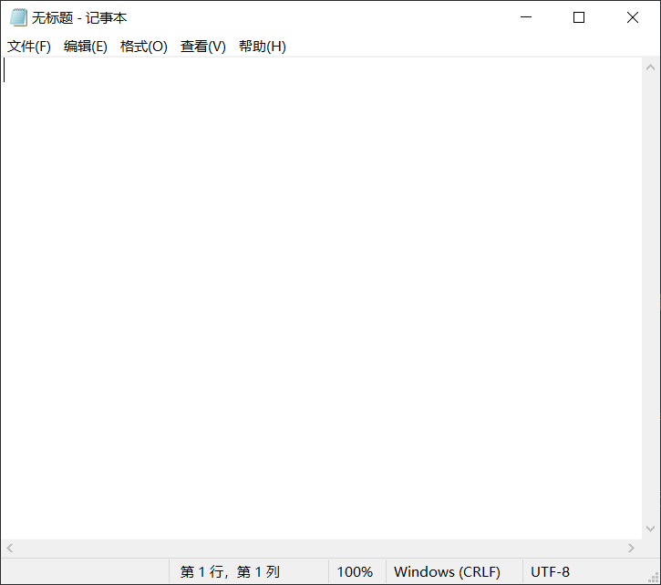

# 快速上手

入门程序世界的第一件事往往是和世界打招呼，那么我们入门C语言当然也采用相同的方式。

> 前排提醒：
>
> 该节部分内容可能对于初学者有些超纲，别担心，慢慢就懂了。
>
> 推荐读者在阅读后面章节的时候不时回来看看😁

## Hello World

笔者在这里偷偷放一个HelloWorld程序：

```C 
#include <stdio.h>

int main(){
	printf("Hello World!");
	return 0;
}
```

## 代码讲解

首先我们需要知道的是：上面的代码是写在一个以`.c`为后缀的**文本文件**里面的。如何最方便的得到这样一个文件呢？

我们只需要在任意目录新建一个文本文件，然后将其重命名为`xxx.c`，其中`xxx`的部分可以是任何名称。

接下来我们来简单的解读一下这段代码都做了什么：

1. 使用**预处理指令**`#include`，引入了位于stdio.h文件中的内容；

   参考内容：预处理、标准库

2. 定义了主**函数**：`main`；

3. 在主函数中调用了stdio中的printf函数，向终端输出`Hello World！`；

4. 设置主函数的返回值为0；

## 运行过程

此处笔者简单介绍一下一个C程序在实际运行之前需要讲过的步骤：编辑、编译、链接、运行。

### 编辑

顾名思义，就是编辑代码内容。笔者之前也说过：C程序的代码其实就是存储在一个以.c为后缀的文本文件中的，这一步我们需要做的事就是按照C语言的语法编辑这个文本文件的内容。

编辑文本文件可以使用的工具很多，最简单的当然就是Windows自带的记事本：



但是真正的代码编写往往不使用记事本来完成，相关话题我们会在后续的**开发环境**小节讲述到。

### 编译

编译文件所用到的工具叫做**编译器**，而需要编译器参与编译生成可执行文件的语言往往被称为编译型语言，C语言是其中最典型的代表。
相对的，还有多种语言的执行是由解释器一边解释一边执行的，我们称其为解释型语言，最典型的代表是Python。

编译器并不是一个特指，而是一类工具的简称。显然，有许多种编译器。其中最具代表性的就是许多Linux发行版作为标准编译器的**GCC**以及被AppleMacOS作为标准的**Clang/LLVM**，而此处我们一般常用的就是GCC编译器。

C语言编译的过程大体可以分为两个步骤：**预处理**和**汇编**。

其中**预处理**的主要作用是**带有简单选择判断机制的替换**：

* 依照`#if`指令来进行一些简单的判断
* 替换`#include`指令为其所包含的目录
* 替换`#define`所声明的宏为其所定义的内容
* ......

而**汇编**的主要作用说的简单点其实就是把C代码翻译成汇编代码。

> 注：此处内容涉及计算机基础知识，没有相关基础的读者可以尝试通过这个视频合集来完善自己的相关知识基础。
>
> 别担心，每集十分钟左右，刚好适合边吃饭边消遣着观看😋
>
> <iframe src="//player.bilibili.com/player.html?aid=21376839&bvid=BV1EW411u7th&cid=38442945" allowfullscreen="true" seamless="seamless" height="300" width="300"> </iframe>

### 链接

我们的代码中往往有许多符号（变量、函数等），而这些符号在使用的其实仅仅是一个符号而已，链接过程所做的事其实就是把这些普通的符号和他们的定义链接到一起，以便它们有自己的意义。

链接的工作往往由链接器来完成。

链接后的最终结果就是生成了可执行程序（.exe），接着就可以运行程序了。

## 开发环境

上面笔者提到了真正的代码编辑往往并不会使用记事本来进行，下面我们就来仔细聊聊C语言的开发环境。

常规的开发为了方便，我们一般使用**集成开发环境（IDE，Integrated Development Environment）**。IDE往往将我们上述提到的工具（编译器、链接器）集成到一起进行统一安装和管理，此外还带有一定的编辑文件以及方便软件开发的其他功能（例如代码高亮、代码补全、快速重构等）。

由于C++与C语言的密切关系，所以我们往往将C与C++相提并论，常用的**C/C++**集成开发环境有：

* 由微软推出的**Visual Studio**（简称VS）
* 由JetBrains推出的**Clion**
* 由BloodshedSoftware推出的**Dev-C++**

部分学校的教学中使用的是老旧的VS2010版本，如果读者希望使用VS进行开发的话，建议使用微软每年在[官网](https://visualstudio.microsoft.com/zh-hans/)发布的最新社区版本（笔者落笔时最新版本为VS2022），网络上相关安装教程泛滥，恕笔者此处不再给出单独的安装教程。

笔者此处抱着一种夹带私货的态度，推荐读者使用Clion进行C语言的开发学习。

此外，既然已经决定开始学习编程，笔者同样推荐读者去看看笔者之前曾写过的一篇文章：[编程Q&A—-环境&Tips](https://zhewana.cn/?p=193)，看不懂没关系，过段时间回来说不定就可以看懂了（doge

---

以上就是快速上手C语言相关的一些知识，还是那句话：没看懂没关系，看个热闹嘛，毕竟慢慢就懂了😋