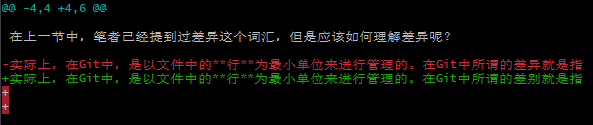
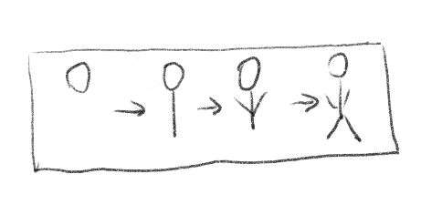
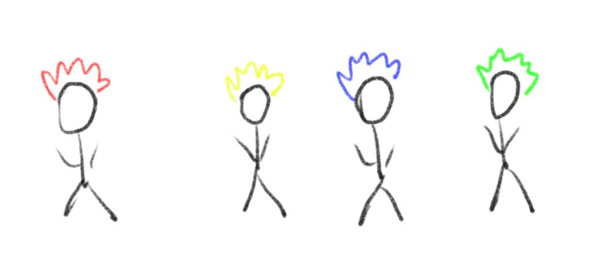
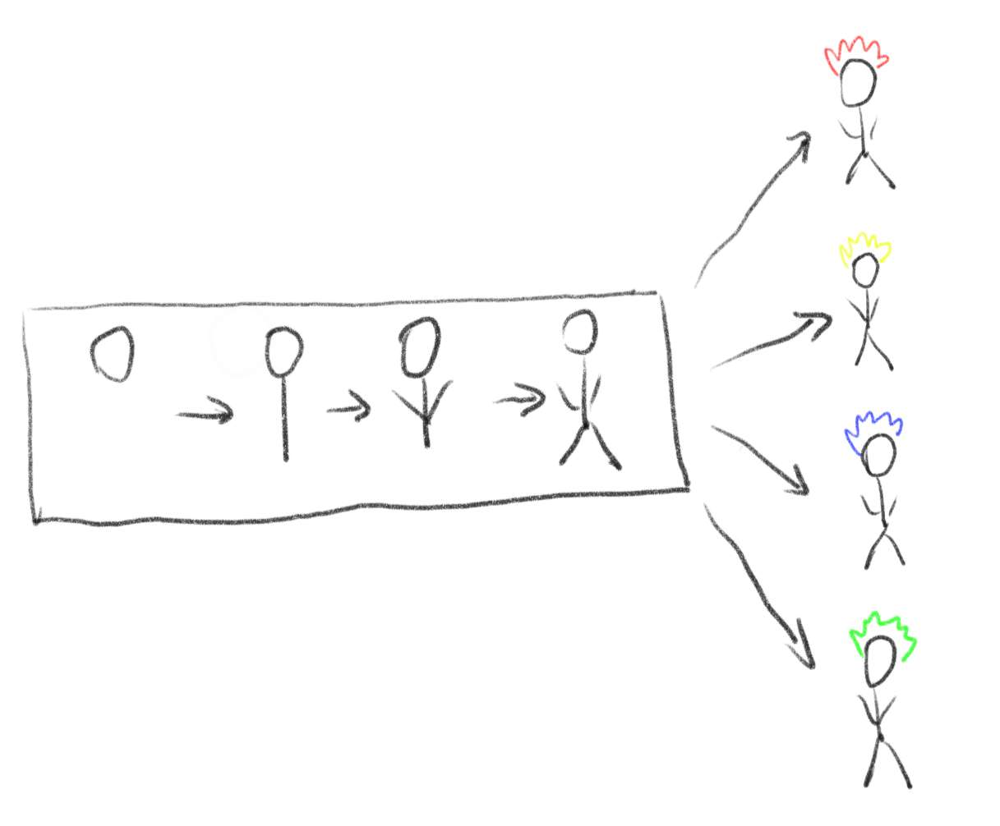

# 分支与差异

本节中，笔者会继续为读者科普一些Git的基础概念，包括但不限于：**分支和差异**。

## 加加减减中看差异

在上一节中，笔者已经提到过差异这个词汇，但是应该**如何理解差异**呢？

实际上，在Git中，是以文件中的**行**为最小单位来进行管理的，在Git中所谓的差异就是指行内容的增减。举一个简单的例子：当笔者将一行中的某个词汇改变之后，运行`git diff`指令即可获悉当前工作区中所产生的差异，如下图所示。

可以看到，虽然我们只是修改了一个词语，但是在Git的视角中，是我们删除了第一行而添加了第二行。**类似这样的文件内容的变化就是我们所说的差异。**

需要强调的是：差异是指工作区中当前文件与**版本库中记录的版本**之间的差异。当你将文件中的差异添加到暂存区之后，该部分内容就已经被纳入了版本库的管理之中，尽管你并没有进行提交，这部分内容也不会被算在差异之中。

## 版本发展中看分支

分支其实是一个很形象的概念，就是指在版本的发展过程中的某个节点开始，新版本会向多个不同的方向发展，那么这些方向就理所当然的被认为是几个分支。举个形象一点的例子：

想象你正在画一幅人像画，首先你完成了一个简单的线稿，这是一个妥妥的线性流程：

但是当你给线稿上色的时候，你忽然想尝试一些不同的尝试，于是你尝试了红、黄、蓝、绿四种颜色的头发：

于是你的画稿实际上的版本发展就是这样子的：

其中每个箭头都代表一个版本的变化。显然，在你给头发上色的过程中产生了四个分支，这四个分支相互独立，又都基于产生分支前的最后一个版本。

产生分支后，各个分支之间互相独立，互不影响。而各个分支所基于的版本线则会被复制成完全相同的四份，所以即使在其中一个分支中修改发生分支之前就已经存在的内容，对其他分支依然不会造成影响。

## 对应概念与指令

与上一节一样，我们来将概念与指令做一个简单的对应：

* 你可以使用`git diff`指令来获取当前工作区中的差异

* 分支相关的指令比较复杂，我们之后再说
